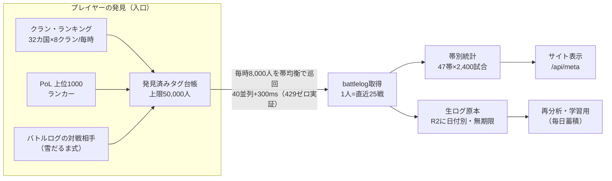

# データ収集の現在地 — 全帯カバーの実測と限界

> **著者**: jo ＋ Claude（設計・実装・実測）
> **最終更新**: 2026-08-11
> **正本**: このファイル。実装は `tools/collect.js`、実測値は各コミットメッセージにも記録。

## 一枚図



## 帯の定義（47帯）

**トロフィー（トロフィーロード）0〜14,099 を 300 刻み**で切った 47 個。

```
0-299, 300-599, 600-899, …, 13500-13799, 13800-14099
```

- あなたの帯 ＝ 直近試合の開始時トロフィー。表示は ±150 の近い帯も見る
- ランク戦（PoL）はトロフィーと別軸なので混ぜず、別集計（上位1000ランカー）

## 「全試合」は誰にも取れない（構造的事実）

- **試合を列挙する API はこの世に存在しない**。試合は必ずプレイヤー経由（`/players/{tag}/battlelog`＝直近25戦）でしか取れない。「アリーナXの今日の全試合」という口は無い
- したがって全数を持つのは Supercell だけ。**RoyaleAPI も観測ベースの標本**（彼らが巡回したタグの分だけ。規模が大きいだけで構造は同じ）
- 現実解は二本立て：
  1. **全体** … 発見と巡回を広げて標本を厚くする（このファイルの主題）
  2. **登録した個人** … 毎時取得すれば**漏れゼロを保証できる**（25戦×最短3分=75分 ＞ 60分。→ `docs/monetization.md`）

## 実測の歴史（拡大の判断はすべて実測に基づく）

| 日付 | 実測 | 判断 |
|---|---|---|
| 2026-08-02 | 同時80並列OK・85で429・70持続は3周目で死亡 | **40並列+300ms を安全ペースに固定**（以後不変） |
| 2026-08-02 | `/locations/{id}/rankings/players` が全254カ国で空 | トロフィーランキングは廃止済み→**クラン経由の発見**へ転換 |
| 2026-08-11 | 全47帯が保持上限800に張り付き | 統計の頭打ちは上限設定が原因→**帯2,400/全体120,000へ** |
| 2026-08-11 | 本収集4.5〜5分／枠30分（6倍の余裕） | ペース不変のまま**シード1,000→4,000** |
| 2026-08-11 | 4,000シードでも 429=0・6.5分で完走 | さらに**8,000へ** |
| 2026-08-11 | 発見11,707人に対し台帳上限8,000＝**毎時3,707人を捨てていた** | **台帳を50,000へ**。飽和はまだ遠い |

## 飽和の判定方法（「取り切った」をどう知るか）

毎時のログに出る `clan-crawl newPlayers=N` を見る。

- N が数千 → まだ広げる（現在ここ。3,707人/時）
- N が数百 → 巡回国・クラン数をもう一段増やして様子見
- N がほぼ0 → **この入口から見える範囲は取り切った**

ただし「入口から見える範囲」＝クランに所属しランキングに載る層＋その対戦相手。クラン未所属で誰の対戦相手にもならないプレイヤーは構造上見えない（これはどのサービスでも同じ）。

## 保持と蓄積（2段構え）

| 層 | 中身 | 保持 |
|---|---|---|
| 表示用の帯別統計 | 47帯 × 上限2,400試合（全体120,000） | ローリング（古い順に譲る） |
| **生ログ原本** | ラン単位の全取得試合 | **R2 に日付別・無期限**（削除コード無し＝毎日積み上がる学習資産） |

## 安全弁

- 429 が出ればログの `rate-limit 429hits=` に必ず出る。増え始めたら拡大を止めて見直す
- 収集は毎時2重トリガ（Worker cron :15 ＋ Actions :37/:57）で freshness gate が重複を防ぐ
