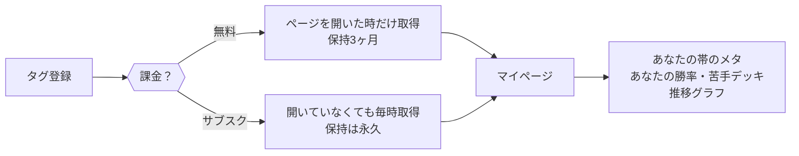

# 課金の設計 — 何にお金を払ってもらうか

> **著者**: jo ＋ Claude（joの決定を正とする）
> **最終更新**: 2026-08-11
> **位置づけ**: AdSense＝土台の収益。**本命は月額サブスク**。アフィリエイトはAdSense審査通過後に文脈の合う物だけ少量（本命ではない）。

## 人がお金を払いたくなる・払うようになる 3つの原則

1. **自分専用の情報** — 一般論ではなく、自分の戦績から出たもの。「あなたの帯で」「あなたは」から始まる情報
2. **手間が消える** — 自分でやれば出来ることが、何もしなくても済んでいる
3. **勝てるようになる実感** — 使う前と後で結果が変わったと本人が感じられる

> 判断に迷ったら、この3つのどれに効くかで決める。どれにも効かない機能は課金の理由にならない。

## 核になる価値：「開いていない間も、自分のデータが溜まっている」

これは**不便の解消**に値する。

- クラロワのAPIは直近25戦しか見せない。つまり**何もしなければ自分の歴史は消え続けている**
- 登録タグを毎時取得すれば漏れゼロを保証できる（25戦×最短3分=75分 ＞ 60分）
- 「開かなくても溜まっている」は原則①（自分専用）と②（手間が消える）を同時に満たし、
  **時間が経つほどデータが濃くなる＝解約しにくくなる**構造を作る

## 無料と有料の線引き（jo決定・2026-08-11）

| | 無料 | サブスク |
|---|---|---|
| 今ある全機能（作成・診断・人気デッキ） | ✅ そのまま | ✅ |
| 自分のデータの取得 | ページを開いた時だけ | **開いていなくても毎時（サーバーが取りに行く）** |
| 自分のデータの保持 | **3ヶ月** | **永久** |
| マイページ | ✅（3ヶ月ぶんで） | ✅（全歴史で） |

- **既存機能は有料に引っ込めない**（絶対）。新しく作る価値だけを有料にする
- 差の説明は一言で済む：「**開いていない間の試合が残るかどうか**」

## マイページ（作る）

自分のためだけのデータの置き場。無料でも入れる（3ヶ月ぶん）。

- あなたの帯のいま：流行デッキ・警戒カード（全47帯の統計から、自分の帯だけ切り出す）
- あなたの成績：勝率・使用デッキ別の成績・苦手デッキ上位（対面別勝率）
- 推移：トロフィーと勝率の時系列（サブスクなら全歴史が繋がる）

他所には作れない理由：**帯のメタ（0〜14,000の全帯統計）× 個人の全試合** を両方持っているのはこのサイトだけ。上位帯のデータしか無いサイトには、中位・下位の「あなたの帯」は語れない。

## 工事の順番

1. サーバー側の個人試合ストア（タグ→試合履歴。3ヶ月/永久の期限つき）
2. 登録タグを毎時収集に相乗り（レート実測済み：数百人規模まで現行ペースで吸収可）
3. マイページ（まず無料3ヶ月ぶんで公開＝価値を見せてから課金導線）
4. Stripe Subscription ＋ isPaid 出し分け（寄付Webhookの配管を流用）

## 決めていないこと（joが決める）

- 価格（候補：月¥300／¥500／¥980）
- サブスクの名前（「エリクサー供給」の世界観の延長で付けられる）
