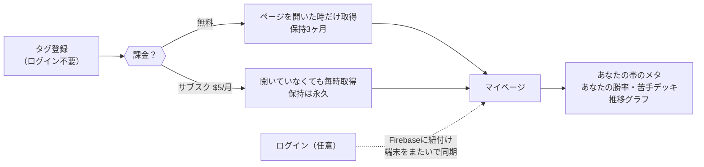

# 課金の設計 — 何にお金を払ってもらうか

> **著者**: jo ＋ Claude（joの決定を正とする）
> **最終更新**: 2026-08-11
> **位置づけ**: AdSense＝土台の収益。**本命は月額サブスク**。アフィリエイトはAdSense審査通過後に文脈の合う物だけ少量（本命ではない）。

## 人がお金を払いたくなる・払うようになる 3つの原則

1. **自分専用の情報** — 一般論ではなく、自分の戦績から出たもの。「あなたの帯で」「あなたは」から始まる情報
2. **手間が消える** — 自分でやれば出来ることが、何もしなくても済んでいる
3. **勝てるようになる実感** — 使う前と後で結果が変わったと本人が感じられる

> 判断に迷ったら、この3つのどれに効くかで決める。どれにも効かない機能は課金の理由にならない。

## 核になる価値：「開いていない間も、自分のデータが溜まっている」

これは**不便の解消**に値する。

- クラロワのAPIは直近25戦しか見せない。つまり**何もしなければ自分の歴史は消え続けている**
- 登録タグを毎時取得すれば漏れゼロを保証できる（25戦×最短3分=75分 ＞ 60分）
- 「開かなくても溜まっている」は原則①（自分専用）と②（手間が消える）を同時に満たし、
  **時間が経つほどデータが濃くなる＝解約しにくくなる**構造を作る

## 無料と有料の線引き（jo決定・2026-08-11）

| | 無料 | サブスク **$5/月** |
|---|---|---|
| 今ある全機能（作成・診断・人気デッキ） | ✅ そのまま | ✅ |
| マイページ | ✅ **タグ登録だけで作れる**（ログイン不要） | ✅ |
| 自分のデータの取得 | ページを開いた時だけ | **開いていなくても毎時（サーバーが取りに行く）** |
| 自分のデータの保持 | **3ヶ月** | **永久** |
| タグの扱い | いつでも変更・取り消し可 | **課金中はロック（解約でロック解除）** |

- **既存機能は有料に引っ込めない**（絶対）。新しく作る価値だけを有料にする
- 差の説明は一言で済む：「**開いていない間の試合が残るかどうか**」
- **上位プラン $8/月** も設ける（中身は未定→下の「決めていないこと」）

### 識別と同期の設計（jo決定・2026-08-11）
- **入口はタグ登録のみ**。アカウント作成を強いない＝立ち上げ摩擦ゼロ
- 端末側は **localStorage** を基本にする。プライベートブラウズや別端末では、
  **タグを再設定すればサーバーからデータを再取得**できる（データの本体はサーバー側にあるから）
- **ログインした人は Firebase の UID とタグを紐付け**て精度を上げる：
  端末をまたいで自動同期・課金状態との照合・タグ乗っ取りの防止。管理も最終的に Firebase 起点が楽
- 無課金の3ヶ月保持もサーバー側（タグをキーに保存）。localStorage は表示キャッシュの役割に降ろす

### 課金者のタグは「課金中だけロック」（jo決定・2026-08-11）
- **課金中**：タグはUIから削除・変更できない（＝ロック）。
  意図＝勝手に消えてデータが途切れる事故を防ぎ、「こちらで回し続ける」を保証する
- **解約後**：**ロック解除**。毎時収集は止まり、通常の無料ユーザーと同じく
  自分で削除・変更できる状態に戻る。蓄積データは保持（再課金すればそのまま続きから）
- 問い合わせ経由の削除依頼にはもちろん応じる（課金中でも）。
  プライバシーポリシーに「タグと戦績の収集・保持・削除依頼の窓口」を明記する
- この整理なら法的にもきれい：「消せない」のは課金中だけで、それは本人が
  契約で得ている保証（データが途切れない）の一部という説明が成り立つ

## マイページ（作る）

自分のためだけのデータの置き場。無料でも入れる（3ヶ月ぶん）。

- あなたの帯のいま：流行デッキ・警戒カード（全47帯の統計から、自分の帯だけ切り出す）
- あなたの成績：勝率・使用デッキ別の成績・苦手デッキ上位（対面別勝率）
- 推移：トロフィーと勝率の時系列（サブスクなら全歴史が繋がる）

他所には作れない理由：**帯のメタ（0〜14,000の全帯統計）× 個人の全試合** を両方持っているのはこのサイトだけ。上位帯のデータしか無いサイトには、中位・下位の「あなたの帯」は語れない。

## 工事の順番

1. サーバー側の個人試合ストア（**タグをキーに**保存。3ヶ月/永久の期限つき）
2. マイページ（**タグ登録だけ**で開ける。localStorage＝キャッシュ、正本はサーバー→タグ再設定で別端末でも復元）
3. 登録タグを毎時収集に相乗り（レート実測済み：数百人規模まで現行ペースで吸収可）
4. ログイン紐付け（Firebase UID⇄タグ。端末同期・課金照合・乗っ取り防止）
5. Stripe Subscription（$5/$8）＋ isPaid 出し分け（寄付Webhookの配管を流用）。課金タグの固定化もここ

## 決めていないこと（joが決める）

- **上位プラン $8/月 の中身**（候補：相性予測＝自分のデッキvs相手デッキの勝率、週次ふりかえり、複数タグ登録、家族/サブアカ枠）
- サブスクの名前（「エリクサー供給」の世界観の延長で付けられる）
- 決済通貨の見せ方（Stripeは$建てでも¥表示でも組める。日本ユーザーには¥表示が親切）
